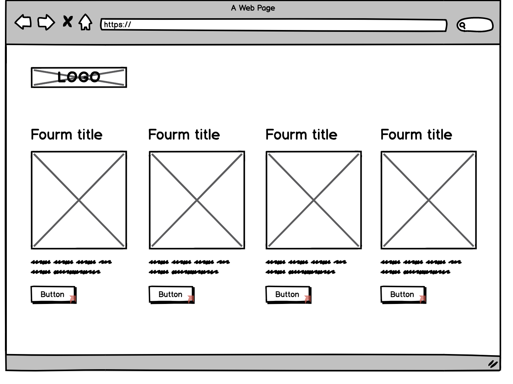
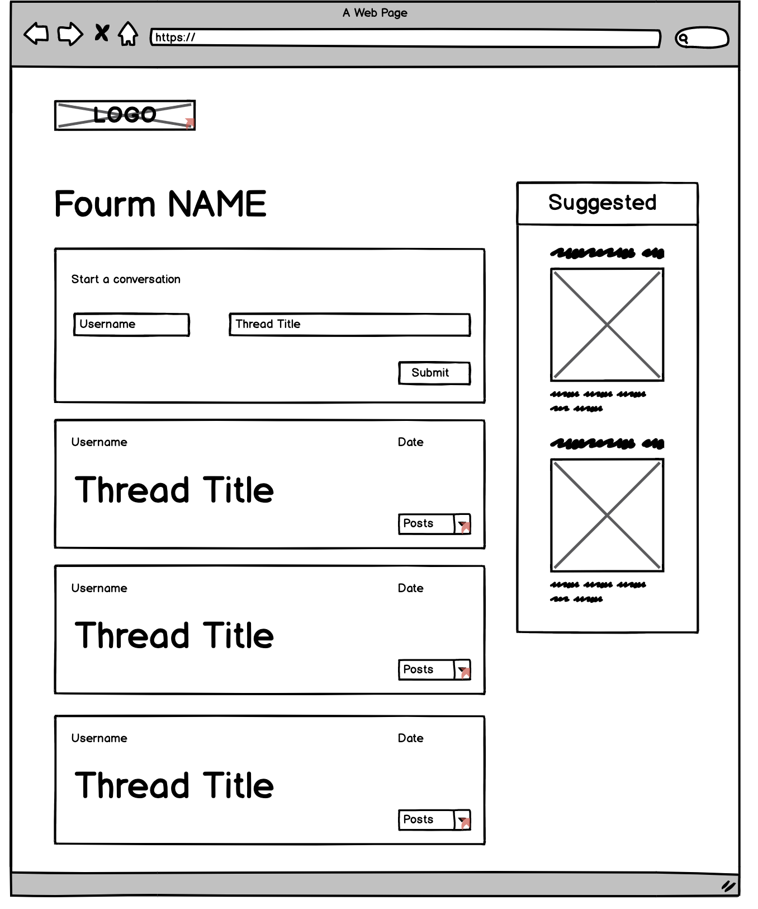
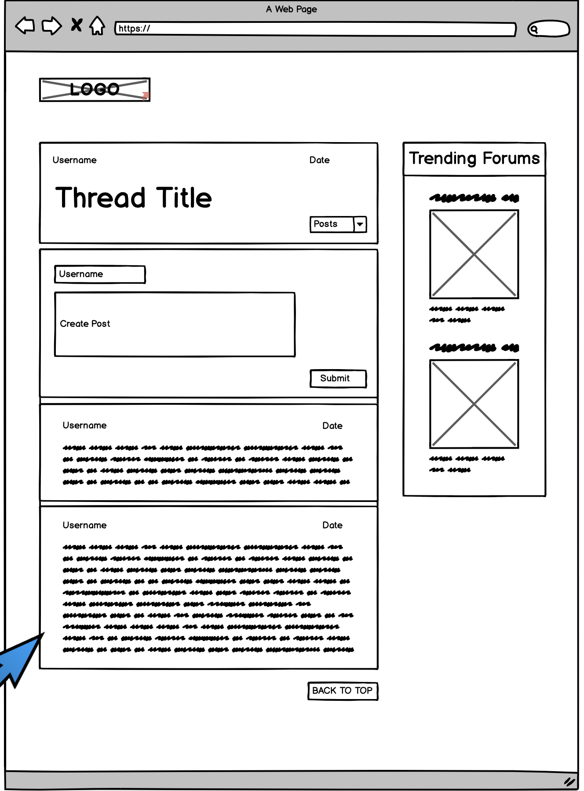

## User Stories
1. As a user I want an app where I can post questions to an open community
2. As a user I want to share links with an open community
3. As a user I want to comment on post shared by other users
4. As a user I want to "like" post shared by other users
5. As a user I want to link my post to topics
6. As a user I want to search post by topic
7. As a user I want save my favorite post
8. As a user I want to create a profile
9. As a user to create a community chat
10. As a user I want to join a community chat
11. As a user I want to direct message other user
12. As a user, I want an app that I can read people's opinions on a certain subject
13. As a user I would like to create my own username

## Installations
- React BootStrap
- React
- Axios
- npm
- DOM Manipulation

## Description
Our app is a open community forum. In this forum you can add a message to any thread and delete your message. We have four forums and in each forum there are threads related to the forum that the user picks. When the user clicks on the forum they will be able to post anything they want that is related to the subject. 

## If we had more time:
- We would have added a button to create a new thread. 
- 

## Wireframe

https://balsamiq.cloud/sxf6i92/pgkeemb/r2278

